  <picture>
    <source media="(max-width: 600px) and (prefers-color-scheme: light)" srcset="./assets/generated/galaxy-header-mobile-light.svg">
    <source media="(max-width: 600px)" srcset="./assets/generated/galaxy-header-mobile.svg">
    <source media="(prefers-color-scheme: light)" srcset="./assets/generated/galaxy-header-light.svg">
    
  </picture>

 

  <picture>
    <source media="(max-width: 600px) and (prefers-color-scheme: light)" srcset="./assets/generated/stats-card-mobile-light.svg">
    <source media="(max-width: 600px)" srcset="./assets/generated/stats-card-mobile.svg">
    <source media="(prefers-color-scheme: light)" srcset="./assets/generated/stats-card-light.svg">
    
  </picture>

 

  <picture>
    <source media="(max-width: 600px) and (prefers-color-scheme: light)" srcset="./assets/generated/tech-stack-mobile-light.svg">
    <source media="(max-width: 600px)" srcset="./assets/generated/tech-stack-mobile.svg">
    <source media="(prefers-color-scheme: light)" srcset="./assets/generated/tech-stack-light.svg">
    
  </picture>

 

  <picture>
    <source media="(max-width: 600px) and (prefers-color-scheme: light)" srcset="./assets/generated/projects-constellation-mobile-light.svg">
    <source media="(max-width: 600px)" srcset="./assets/generated/projects-constellation-mobile.svg">
    <source media="(prefers-color-scheme: light)" srcset="./assets/generated/projects-constellation-light.svg">
    
  </picture>

 

  <strong>Ethical hacker based in Paris</strong> 
  Security research, CTF tools, and macOS command-line projects.

 

  
  

 

  Profile visuals are generated from public GitHub data with <a href="https://github.com/vinimlo/galaxy-profile">galaxy-profile</a>. See <a href="./GENERATOR.md">generator details</a> and the <a href="./LICENSE">GPL-3.0 license</a>.

<!-- farheinheigt/farheinheigt is the special profile repository; this README appears on the GitHub profile. -->
